# Plebiscitos del Proceso Constituyente en Chile, 2020-2022
## Introducción, Motivación y Audencia. 

Para detener el llamado [estallido social](https://es.wikipedia.org/wiki/Estallido_social) toma fuerza un [proceso constituyente](https://es.wikipedia.org/wiki/Proceso_constituyente_en_Chile) en chile. Se realiza un plebiscito de entrada con la pregunta "¿Quiere usted una Nueva Constitución?" y dos opciones: apruebo y rechazo: Gana el apruebo con el 78% de los votos. Dos años después, la nueva constitución -redactada por un grupo de personas electas para ese propósito- se somete a plebiscito y es rechazada con un 62% de los votos. Allí donde un 78% de las personas votaron apruebo la primera vez, un sólo un 38% votó igual la segunda. ¿Qué cambió? Esta pregunta es de interés para cualquiera involucrado en el negocio de la política chilena. Además, resulta de interés académico para comprender procesos políticos más complejos, al tratarse de un caso en donde se visualizan, si se prueba nuestra hipótesis, marcadas diferencias entre la población que asiste voluntariamente a votar y aquella que no: esto tiene implicancias de política pública, pero también en los campos del marketing social, dibujando claramente dos segmentos de la población general que llegan a sus decisiones de votación de manera marcadamente diferente. 

Algunos cambios son de público conocimiento: mayor cantidad de votantes debido al régimen de voto obligatorio universal, una cosa nunca antes vista en Chile. Un proceso constituyente pleno de controversias incansablemente cubiertas por los medios. Una pandemia global, y un proceso de inflación con cero crecimiento del PIB, entre otros. Gracias a que el SERVEL publica datos de resultados eleccionarios a nivel de mesa, esto admite análisis cuantitativo. 

Los resultados de todo chile en ambos plebiscitos se encuentran aquí https://www.servel.cl/resultados-en-excel-por-mesa-a-partir-del-ano-2012/, en particular el plebiscito del 2020 y del 2022. La pregunta obvia es: si hubieron más votantes que antes, y hubo más voto rechazo que antes, ¿están estos dos hechos relacionados? es decir:

## Hipótesis

* h1: Fueron los nuevos votantes los que cambiaron el resultado?

Resulta de interés notar que la mesa electoral no es un nivel de análisis válido para comparaciones entre los dos plebiscitos, ya que entre 2020 y 2022 el servicio electoral de Chile SERVEL barajó a los electores y re-organizó las mesas. por ello, los datos tendrán que ser agregados al nivel de los locales de votación. También, que no es una cuestión trivial la hipótesis: una posibilidad alternativa es que la probabilidad de votar rechazo haya aumentado entre todos los votantes, por ejemplo porque la nueva constitución no cumplía con las expectativas de aquellos que votaron apruebo

## Limpieza de Datos

(este notebook es una continuación de 'Explorando los plebiscitos', [ubicable aquí](https://www.dropbox.com/s/uotx8idcpkxehpy/Explorando%20los%20Plebiscitos.ipynb?dl=0), pero no se incluye el mismo proceso de limpieza de datos que en el anterior porque a) el proceso toma algún tiempo, y b) para este notebook utilizo un ambiente fresco, que fué la única manera de lograr instalar geopandas.) Tendrá que ser suficiente decir que el dataset original son dos, uno para cada plebiscito, venía agregado a nivel de mesa, y contenía sólo los números de cada opción de voto: se agregaron los datos a nivel de comuna (una unidad geográfico-política de chile que corresponde a un pueblo mediano, a una zona rural o a un barrio de una ciudad grande) y se realizaron una serie de cálculos deduciendo la probabilidad de voto de las personas de esa comuna (por ejemplo, si en una comuna hay 100 electores y 20 votaron apruebo, se entiende que la probabilidad de votar apruebo para esa comuna era 0.2). El dataset procesado se almacenó en este pickle. 


```python
import geopandas
import pandas as pd
import matplotlib.pyplot as plt
import folium
#indexamos al dataset de los plebiscitos datos geográficos para su ploteo
comunas_in = geopandas.read_file('comunas.shp')
plebiscitos = pd.read_pickle('plebiscitos.pkl')
def homologar(string):
    x = string.replace('é','e').replace('á','a').replace('í','i').replace('ó','o').replace('ú','u')
    return x.upper()
comunas_in['comuna'] = comunas_in['Comuna'].apply(homologar)
comunas = comunas_in.sort_values(by='comuna').set_index('comuna')
df = plebiscitos.join(other=comunas, lsuffix='pleb_', rsuffix='com_')
gdf = geopandas.GeoDataFrame(df, geometry='geometry')
gdf.columns
```


    Index(['entrada_electores', 'entrada_apruebo', 'entrada_rechazo',
           'entrada_blancos', 'entrada_nulos', 'salida_electores',
           'salida_apruebo', 'salida_rechazo', 'salida_blancos', 'salida_nulos',
           'crec_apruebo', 'crec_rechazo', 'crec_nulos', 'crec_blancos',
           'aumento_votantes', 'aumento_votantes_p', 'entrada_votos',
           'entrada_abs', 'entrada_p_vot', 'salida_votos', 'salida_abs',
           'salida_p_vot', 'crec_prob_voto', 'entrada_prob_apruebo',
           'salida_prob_apruebo', 'entrada_prob_nulo', 'salida_prob_nulo',
           'entrada_prob_blanco', 'salida_prob_blanco', 'entrada_prob_rechazo',
           'salida_prob_rechazo', 'crec_prob_apruebo', 'crec_prob_rechazo',
           'crec_prob_nulo', 'crec_prob_blanco', 'entrada_prob_votar',
           'salida_prob_votar', 'crec_padron', 'crec_padron_porc',
           'salida_validos', 'entrada_validos', 'salida_porc_rechazo',
           'entrada_porc_rechazo', 'crec_margen_porcentual_rechazo', 'objectid',
           'shape_leng', 'dis_elec', 'cir_sena', 'cod_comuna', 'codregion',
           'st_area_sh', 'st_length_', 'Region', 'Comuna', 'Provincia',
           'geometry'],
          dtype='object')


Nótese que las columnas 'crec', por ejemplo crec prob apruebo, corresponden al crecimiento de la probabilidad de una opción de voto entre el plebiscito de entrada y el de salida: esto es, si en una comuna la probabilidad de votar apruebo era 0.7 y luego en el desalida fué de 0.6, se entiende que el crecimiento de la probabilidad de votar apruebo fué de -0.1. Analicemos, pues, exploratoriamente, los cambios en las probabilidades de votar apruebo y rechazo.

## Análisis Exploratorio y Prueba de Hipótesis


```python
import seaborn as plot
plot.histplot(data=df,x='crec_prob_apruebo', element='step')
```


    <AxesSubplot: xlabel='crec_prob_apruebo', ylabel='Count'>


    
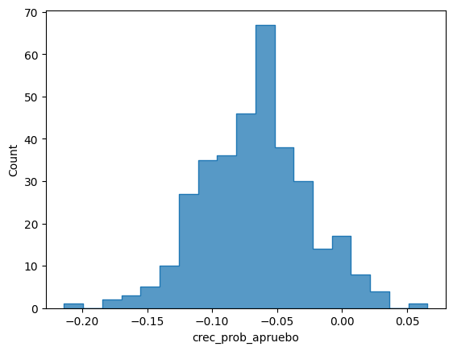
    


La probabilidad de votar apruebo, si bien baja un poco, en general se mantiene más o menos igual entre los dos plebiscitos: Recordemos que la probabilidad la calculamos como los votos apruebo sobre las personas que podrían haber votado apruebo. una interpretación posible de este gráfico es que *básicamente, votaron apruebo las mismas personas en ambas elecciones*


```python
plot.histplot(data=df,x='crec_prob_rechazo', element='step')
```


    <AxesSubplot: xlabel='crec_prob_rechazo', ylabel='Count'>


    
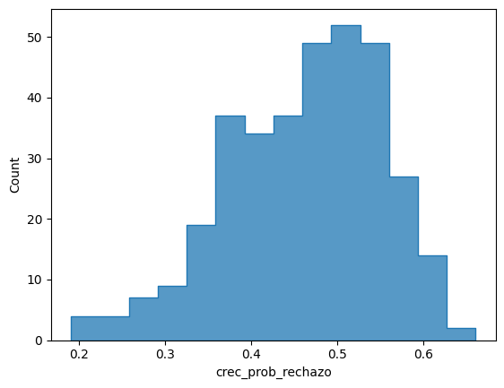
    


Por otro lado, la probabilidad de votar rechazo creció, pero lo hizo de manera diferente en diferentes comunas: el grueso de los casos están entre un 35% y un 60% de aumento, lo cual es bastante: una lectura posible de este gráfico es que *mucha gente que antes no votó rechazo, ahora votó rechazo*.

Ahora bien, si nuestra hipótesis fuese totalmente correcta, es decir esta predijera el 100% del crecimiento del rechazo, esperaríamos que cada votante nuevo votara rechazo: esto se vería, a nivel de comunas, como una correlación perfecta entre el crecimiento de la probabilidad de voto (es decir, cuantas personas que no votaron en la entrada votaron en la salida) y el crecimiento de la probabilidad de votar rechazo (es decir, cuántas personas que no votaron rechazo en la entrada votaron rechazo en la salida). Sospechamos que, por existir otros factores en juego, es probable que en la realidad la correlación no sea perfecta: sin embargo, veamos


```python
print(df[['crec_prob_voto','crec_prob_rechazo']].corr('pearson').iloc[0,1])
print(df[['crec_prob_voto','crec_prob_rechazo']].corr('spearman').iloc[0,1])
print(df[['crec_prob_voto','crec_prob_rechazo']].corr('kendall').iloc[0,1])
print('r^2 prob de voto y crecimiento del rechazo: ',((df[['crec_prob_voto','crec_prob_rechazo']].corr('pearson')).iloc[1,0])**2)
print('puntos son comunas')
plot.regplot(data=df, x='crec_prob_voto', y='crec_prob_rechazo')
```

    0.8987390244843385
    0.8906699643601482
    0.7156078378195132
    r^2 prob de voto y crecimiento del rechazo:  0.8077318341310604
    puntos son comunas
    


    <AxesSubplot: xlabel='crec_prob_voto', ylabel='crec_prob_rechazo'>


    
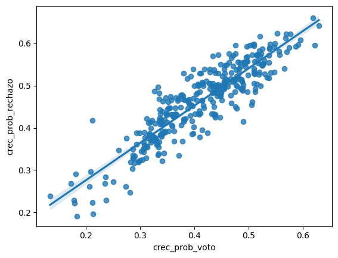
    


Finalmente, en términos gráficos, cabría esperar que visualmente la distribución del crecimiento de la probabilidad de voto y el crecimiento de la probabilidad de voto rechazo fuera muy similar. 


```python
import geopandas
import pandas as pd
import matplotlib.pyplot as plt
import folium
#indexamos al dataset de los plebiscitos datos geográficos para su ploteo
comunas_in = geopandas.read_file('comunas.shp')
plebiscitos = pd.read_pickle('plebiscitos.pkl')
def homologar(string):
    x = string.replace('é','e').replace('á','a').replace('í','i').replace('ó','o').replace('ú','u')
    return x.upper()
comunas_in['comuna'] = comunas_in['Comuna'].apply(homologar)
comunas = comunas_in.sort_values(by='comuna').set_index('comuna')
df = plebiscitos.join(other=comunas, lsuffix='pleb_', rsuffix='com_')
gdf = geopandas.GeoDataFrame(df, geometry='geometry')
fig, axs = plt.subplots(1, 2, figsize=(12, 6))
axs[0].get_xaxis().set_visible(False)
axs[1].get_xaxis().set_visible(False)
axs[0].get_yaxis().set_visible(False)
axs[1].get_yaxis().set_visible(False)
axs[0].set_title('Crecimiento de la Probabilidad de Votar')
axs[1].set_title('Crecimiento de la Opción Rechazo')
gdf.plot("crec_prob_voto", ax=axs[0], cmap="Blues")
gdf.plot("crec_prob_rechazo", ax=axs[1], cmap="Greens")
```


    <AxesSubplot: title={'center': 'Crecimiento de la Opción Rechazo'}>


    
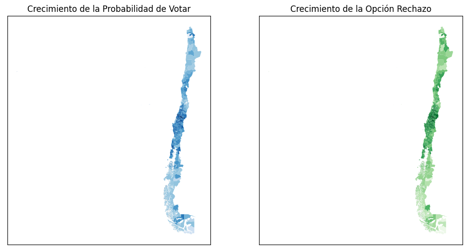
    


Si bien la distribución no es exactamente idéntica, si son bastante parecidas. Así, pues, debemos concluir tentativamente que nuestra hipótesis es correcta y que, al menos en una buena medida (podríamos decir, suficiente para explicar el 80% de la varianza) el aumento del rechazo se explica por el aumento de la probabilidad de voto; esto es consistente con que, a grandes rasgos, el triunfo del rechazo fué por los nuevos votantes. No ocurre lo mismo con el cambio en la probabilidad de votar apruebo:


```python
fig, axs = plt.subplots(1, 2, figsize=(12, 6))
axs[0].get_xaxis().set_visible(False)
axs[1].get_xaxis().set_visible(False)
axs[0].get_yaxis().set_visible(False)
axs[1].get_yaxis().set_visible(False)
axs[0].set_title('Crecimiento de la Probabilidad de Votar')
axs[1].set_title('Cambio en Opción Apruebo')
gdf.plot("crec_prob_voto", ax=axs[0], cmap="Reds")
gdf.plot("crec_prob_apruebo", ax=axs[1], cmap="seismic", legend=True)
```


    <AxesSubplot: title={'center': 'Cambio en Opción Apruebo'}>


    
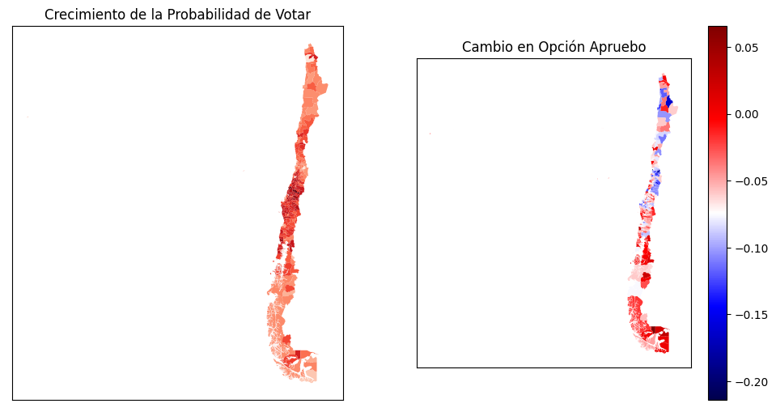
    


```python
plot.regplot(data=df, x='crec_prob_voto', y='crec_prob_apruebo')
```


    <AxesSubplot: xlabel='crec_prob_voto', ylabel='crec_prob_apruebo'>


    
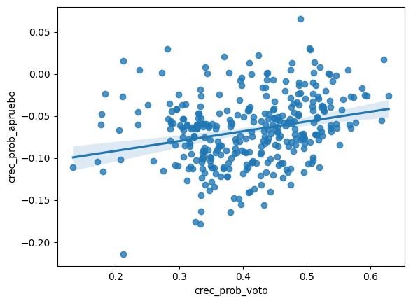
    


La opción apruebo, por otro lado, tiene una correlación muy tenue, quizás inexistente, con el cambio en la probabilidad de voto, por lo que los votantes nuevos no tuvieron ninguna inclinación tendencia detectable hacia la opción apruebo: así, debemos suponer que, de los votantes nuevos, muy pocos votaron por la opción apruebo (lo cual es consistente con lo inverso, que de los votantes nuevos, muchos se inclinaron por la opción rechazo, nuestra hipótesis original).

## Buscando correlatos de la variable dependiente

¿tiene el comportamiento de votación, comparado entre el primer plebiscito y el segundo, algúna correlación con otras variables? en este apartado procederemos a explorar la respuesta: en [este link](https://www.comunidadescolar.cl/wp-content/uploads/2019/10/I%CC%81NDICE-DE-POBREZA-POR-COMUNA-2017.pdf) están los datos del porcentaje de personas
en situación de pobreza por ingresos al año 2017 entregados por el ministerio de desarrollo social. Estimamos que entre 2017 y 2020-2022 no debería haber habido una enorme movilidad en términos de las comunas más ricas volviendose más pobres o viceversa, por lo que en ausencia de data más actualizada utilizaremos esta. 

Como es más o menos sabido en ciencias políticas, las personas menos pobres votan más que las personas más pobres: varias razones han sido propuestas para explicar este fenómeno, pero su existencia está [relativamente bien establecida](https://money.cnn.com/2012/09/24/news/economy/rich-vote-more/index.html). Así, resulta de interés, además de la correlación que pueda existir entre el ingreso de las personas y el crecimiento del rechazo, la correlación entre la riqueza y la probabilidad de votar en el primer plebiscito, que fué obligatorio. En este caso, los datos que tenemos son sobre el porcentaje de pobreza de las comunas, pero lo segundo es, en nuestra opinión, un buen indicador de lo primero.

_nota: en este punto del notebook reiniciamos el kernel; esto porque geopandas no parece llevarse bien con el resto de las librerías que normalmente ocupamos, por lo que fué necesario crear un virtual env específico para hacer cosas con geopandas_


```python
import pandas as pd
import matplotlib.pyplot as plt
import seaborn as sns
ppc = pd.read_csv('pobreza_por_comunas.csv')
def homologar(string):
    x = string.replace('é','e').replace('á','a').replace('í','i').replace('ó','o').replace('ú','u')
    return x.upper()
def deporcentuar(string):
    x = float(string[:-1])/100
    return x
ppc['porc_pobreza']=ppc['Porcentaje de personas\nen situación de pobreza\npor ingresos 2017'].apply(deporcentuar).astype(float)
ppc['comuna'] = ppc['Nombre comuna'].apply(homologar).drop(columns='Nombre comuna')
ppc = ppc.set_index('comuna')['porc_pobreza']
plebiscitos = pd.read_pickle('plebiscitos.pkl')
d = plebiscitos.merge(ppc.rename('porc_pobreza'), left_index=True, right_index=True)

print('correlación entre porcentaje de pobreza y la probabilidad de votar en el primer plebiscito: ')
print(round(d[['entrada_p_vot','porc_pobreza']].corr(method='spearman').iloc[0,1],3))

print('correlación entre porcentaje de pobreza y crecimiento de la probabilidad de voto es: ')
print(round(d[['crec_prob_voto','porc_pobreza']].corr(method='spearman').iloc[0,1],3))

print('correlación entre porcentaje de pobreza y crecimiento de la probabilidad de votar rechazo es: ')
print(round(d[['crec_prob_rechazo','porc_pobreza']].corr(method='spearman').iloc[0,1],3))

```

    correlación entre porcentaje de pobreza y la probabilidad de votar en el primer plebiscito: 
    -0.573
    correlación entre porcentaje de pobreza y crecimiento de la probabilidad de voto es: 
    0.699
    correlación entre porcentaje de pobreza y crecimiento de la probabilidad de votar rechazo es: 
    0.62
    


```python
sns.regplot(data=d, x='crec_prob_voto', y='porc_pobreza')
```


    <AxesSubplot:xlabel='crec_prob_voto', ylabel='porc_pobreza'>


    
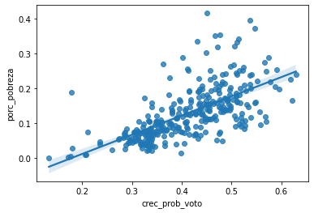
    


```python
print('correlación entre porcentaje de pobreza y crecimiento de la probabilidad de voto es: ')
print(round(d[['crec_prob_voto','yauth']].corr(method='spearman').iloc[0,1],3))
```

    correlación entre porcentaje de pobreza y crecimiento de la probabilidad de voto es: 
    -0.606
    


```python
print('dispersograma: probabilidad comunal de voto vs. porcentaje comunal de pobreza')
sns.regplot(data=d, x='porc_pobreza', y='entrada_p_vot')
```

    dispersograma: probabilidad comunal de voto vs. porcentaje comunal de pobreza
    


    <AxesSubplot:xlabel='porc_pobreza', ylabel='entrada_p_vot'>


    
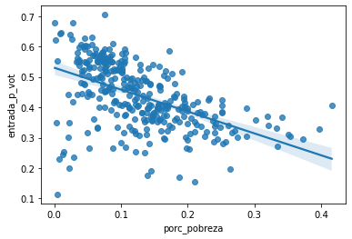
    


gráficamente, podemos ver que la tendencia es clara, pero que es menos clara en los extremos: es decir que si bien existen algunas comunas muy pobres donde la probabilidad de voto fué un tanto más alta de lo esperado, y que por otro lado algunas comunas muy ricas (casi sin pobres) tuvieron probabilidades de voto muy bajas en el plebiscito de entrada, en términos generales se observa una correlación relevante entre la pobreza y la probabilidad de voto en el plebiscito de entrada: esto se combina con lo ya descubierto (que el aumento en la probabilidad de voto en una comuna explica poderosamente el crecimiento de la preferencia por la opción rechazo en dicha comuna) de la manera que esperaríamos: la correlación entre porcentaje de pobreza y crecimiento de la probabilidad de votar rechazo es relativamente elevada, aunque no explica la totalidad de la varianza: este decrecimiento en el poder explicativo de la variable independiente se lo podemos atribuir a que, naturalmente, el porcentaje de pobreza de una comuna es un indicador razonable pero no perfecto de la riqueza de una comuna, toda vez que estar por encima de la línea de pobreza (en chile, $207.917 pesos, algo así como 200 dolares) puede significar muchos niveles de riqueza diferentes: una persona que vive sola y gana el sueldo mínimo en chile, cerca de los 400 dólares al mes, está por encima de la línea de la pobreza, pero también lo está una persona que vive en un hogar promedio de una de las comunas más afluentes de la república (Las Condes, con ~3300 dólares al mes de ingreso familiar promedio). 

Así, ceteris paribus, esperaríamos que si bien el porcentaje de pobreza en una comuna es un buen predictor del crecimiento del rechazo en una comuna (y del crecimiento de la opción rechazo), lo debería ser aún más el nivel de ingreso de una comuna. Como se da la casualidad de que por estos días el dólar está en aprox 1000 pesos, y que mil pesos es una cantidad de dinero fácil para personas no chilenas de imaginar (es el coste de, por ejemplo, medio litro de cerveza, un litro de leche, una caja de 24 tornillos, o de un kilogramo de arroz), miles de pesos será la medida que utilizaremos. 


```python
casen = pd.read_spss('Casen_en_Pandemia_2020_revisada202209.sav', usecols=['comuna', 'yauth'])
casen['yauth']=casen['yauth']/1000
casen['comuna']=casen['comuna'].apply(homologar)
casen = casen.set_index('comuna')
casen_ycom = casen.groupby(by='comuna').median()
casen_ycom['yauth']=round(casen_ycom['yauth'],3)
d = d.merge(casen_ycom['yauth'].rename('yauth'), left_index=True, right_index=True)
```

Sólo para confirmar que nuestro tratamiento de los datos ha sido correcto (así como nuestra intuición de que el porcentaje de pobreza es un predictor decente de la riqueza de una comuna), revisemos la correlación entre el porcentaje de pobreza y la columna yauth, que es el código que se le da en chile al ingreso autónomo del hogar. 


```python
print(round(d[['porc_pobreza','yauth']].corr(method='spearman').iloc[0,1],3))
```

    -0.66
    

Correlación negativa y robusta, como cabría de esperarse: a mayor ingreso de los hogares en una comuna, menos de ellos caen por debajo de la línea nacional de pobreza: continuamos


```python
print(round(d[['crec_prob_rechazo','yauth']].corr(method='spearman').iloc[0,1],3))
sns.regplot(data=d, x='yauth', y='crec_prob_rechazo')
```

    -0.48
    


    <AxesSubplot:xlabel='yauth', ylabel='crec_prob_rechazo'>


    
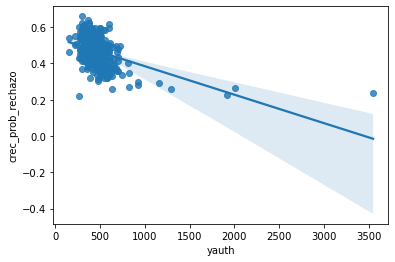
    


usando información esta vez no sobre la pertenencia al grupo de personas debajo de la línea de la pobreza, sino del ingreso en general, las cosas se ven menos claras: la correlación es menor, y esto parece atribuible a las pocas comunas con ingresos autonomos medianos por sobre del millón de pesos. Esto puede deberse a diferentes efectos de saturación, es decir, tanto a que por encima del millón de pesos de ingreso mediano el efecto puede ser que se diluya (ya que la diferencia entre las condiciones objetivas de una persona que vive en un hogar afluente no fuera tan diferente a las de una que vive en un hogar mucho más afluente), o también a que las comunas muy ricas tenían relativamente poco margen de crecimiento para el rechazo, por ejemplo porque que en estas en el plebiscito de entrada casi todas las personas habían votado. 


```python
bajomil = d[d['yauth']<1000]
print(round(bajomil[['crec_prob_rechazo','yauth']].corr(method='spearman').iloc[0,1],3))
sns.regplot(data=bajomil, x='yauth', y='crec_prob_rechazo')
```

    -0.455
    


    <AxesSubplot:xlabel='yauth', ylabel='crec_prob_rechazo'>


    
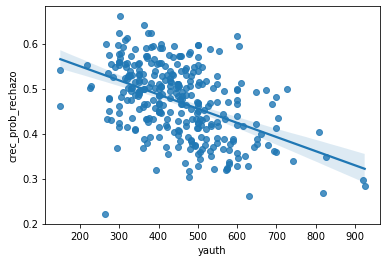
    


```python
print(round(bajomil[['yauth','entrada_p_vot']].corr(method='spearman').iloc[0,1],3))
sns.regplot(data=bajomil, x='yauth', y='entrada_p_vot')
```

    0.566
    


    <AxesSubplot:xlabel='yauth', ylabel='entrada_p_vot'>


    
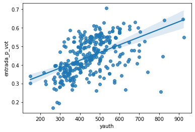
    


Dentro de estas comunas, que podríamos llamar 'normales', es decir, con ingresos medios del hogar por debajo del millón de pesos, que son la mayoría, si vemos que la probabilidad de votar en el plebiscito de entrada está correlacionada con el nivel de ingresos, pero aún así la dispersión es relativamente alta y la correlación sólo alcanza un -0,45. Pareciera ser que el nivel de ingresos (o la pobreza) no permite predecir con mayor precisión la variable dependiente (el crecimiento de la opción rechazo en una comuna) que simplemente el crecimiento de la opción rechazo en dicha comuna.

Finalmente, cabría hacerse la pregunta de si el nivel de pobreza o de ingreso de una comuna entrega aumenta en alguna medida la predictividad del modelo definido por la hipótesis:


```python
import statsmodels.formula.api as smf
from sklearn.model_selection import train_test_split

y = d['crec_prob_rechazo']
x = d[['entrada_p_vot']]

dtrain, dtest = train_test_split(d, test_size=0.25, random_state=105)
model = smf.ols(formula='crec_prob_rechazo ~ crec_prob_voto', data=dtrain).fit()
model2 = smf.ols(formula='crec_prob_rechazo ~ crec_prob_voto + porc_pobreza', data=dtrain).fit()
model3 = smf.ols(formula='crec_prob_rechazo ~ crec_prob_voto + yauth', data=dtrain).fit()
model.rsquared, model2.rsquared, model3.rsquared
print(model.summary())
```

                                OLS Regression Results                            
    ==============================================================================
    Dep. Variable:      crec_prob_rechazo   R-squared:                       0.799
    Model:                            OLS   Adj. R-squared:                  0.798
    Method:                 Least Squares   F-statistic:                     941.8
    Date:                Sun, 06 Nov 2022   Prob (F-statistic):           1.60e-84
    Time:                        19:01:18   Log-Likelihood:                 440.34
    No. Observations:                 239   AIC:                            -876.7
    Df Residuals:                     237   BIC:                            -869.7
    Df Model:                           1                                         
    Covariance Type:            nonrobust                                         
    ==================================================================================
                         coef    std err          t      P>|t|      [0.025      0.975]
    ----------------------------------------------------------------------------------
    Intercept          0.1143      0.012      9.720      0.000       0.091       0.137
    crec_prob_voto     0.8577      0.028     30.689      0.000       0.803       0.913
    ==============================================================================
    Omnibus:                        0.494   Durbin-Watson:                   2.049
    Prob(Omnibus):                  0.781   Jarque-Bera (JB):                0.473
    Skew:                           0.107   Prob(JB):                        0.789
    Kurtosis:                       2.963   Cond. No.                         13.1
    ==============================================================================
    
    Notes:
    [1] Standard Errors assume that the covariance matrix of the errors is correctly specified.
    

La respuesta parece ser que no, el porcentaje de pobreza aumenta en un 1% el r<sup>2</sup> del modelo: la capacidad de los tres modelos es básicamente idéntica. Los supuestos del mismo, por otro lado, parecen cumplirse. Así, pues, sólo nos resta validar el modelo evaluando sus resultados para los datos de training. 


```python
dtest['pred']=model.predict(exog=dtest['crec_prob_voto'])
print('rsq: ',dtest[['crec_prob_rechazo','pred']].corr().iloc[0,1]**2)
```

    rsq:  0.8477779620097611
    

# Conclusión

Establecemos que el modelo de regresión en cuestión es capaz de, entrenado con un split de 25/75, predecir el 84% de la varianza del crecimiento en la preferencia de la opción rechazo en el segundo plebiscito a partir sólo del crecimiento de la probabilidad de voto a nivel de comunas: esto significa que, al menos con un alto grado de certeza, la mayoría del crecimiento del rechazo en el plebiscito de 2022 se debe a los nuevos votantes, es decir, a los que no votaron en el primer plebiscito pero que sí votaron en el segundo: **son, entonces, los nuevos votantes los que explican la diferencia entre el primer y segundo plebiscitos.** 

# Anexo: El Efecto de la Educación

La pregunta inmediata que emerge de la confirmación de nuestra hipótesis es, naturalmente, _por qué?_ Por una parte, nos atrevemos a decir a partir de la intuición pura (este punto puede demostrarse empírica y teóricamente, pero esto escapa al alcance de este trabajo) que los nuevos votantes se deben a que el segundo plebiscito fué obligatorio. Así, pues, la cuestión de quiénes fueron los nuevos votantes toma interés en orden a contestar una pregunta que emerge naturalmente de este análisis, a saber, _por qué las personas que votaron por obligación votaron distinto?_

Algunas de las explicaciones que cabe imaginarse respecto de por qué el voto obligatorio afecta los resultados electorales son:

* las personas de mayores ingresos votan más
* las personas con mayor educación votan más
* las personas con mayor interés en política votan más

La primera no parece ser nuestra explicación: si bien es verdad que las personas de mayor ingreso votaron más, el crecimiento del rechazo en el segundo plebiscito se observa tanto en los sectores de mayor ingreso como en los de menor, y si bien la pobreza tiene una correlación con el aumento del rechazo a nivel comunal, esta es relativamente débil y aún más débil lo es la correlación entre el ingreso familiar mediano de la comuna y el crecimiento del rechazo que se dió en ella. 

Examinemos, pues, el efecto de la educación en la cuestión del crecimiento del rechazo: afortunadamente, CASEN nos entrega algunos datos sobre la ocupación de las personas, y podemos arriesgarnos a decir que, de las categorías que la encuesta CASEN nos disponibiliza, las categorías de profesionales, científicos, intelectuales, técnicos y profesionales de nivel medio, directores, gerentes, administradores y personal de apoyo administrativo corresponden a las ocupaciones que requieren tener acceso a la educación superior para desempeñarlos [aquí el listado de códigos](http://observatorio.ministeriodesarrollosocial.gob.cl/storage/docs/casen/2020/Libro_de_codigos_Base_de_Datos_Casen_en_Pandemia_2020.pdf) con las categorías todas, ver p39. Otra forma de describir la información contenida en la variable 'educados' podría ser la proporción de _oficinistas_ en la población de la comuna. 


```python
cols = ['comuna', 'yauth', 's13', 'oficio1_08']

ppc = pd.read_csv('pobreza_por_comunas.csv')
ppc['porc_pobreza']=ppc['Porcentaje de personas\nen situación de pobreza\npor ingresos 2017'].apply(deporcentuar).astype(float)
ppc['comuna'] = ppc['Nombre comuna'].apply(homologar).drop(columns='Nombre comuna')
ppc = ppc.set_index('comuna')
plebiscitos = pd.read_pickle('plebiscitos.pkl')
d = plebiscitos.join(ppc)
casen = pd.read_spss('Casen_en_Pandemia_2020_revisada202209.sav', usecols=cols)
casen['yauth']=casen['yauth']/1000
casen['comuna']=casen['comuna'].apply(homologar)
casen = casen.set_index('comuna')
casen2 = casen.groupby(by='comuna').median()
casen2['yauth']=round(casen_ycom['yauth'],3)
df = d.join(casen2)
def reco(i):
    if i == 'Sistema Público FONASA':
        x = 1
    else:
        x = 0
    return x
casen['fonasa?']=casen['s13'].apply(reco) 
def reco(i):
    if i == 'FF.AA. y del Orden':
        x = 1
    else:
        x = 0
    return x
casen['FFAA?']=casen['s13'].apply(reco) 
def reco(i):
    if i == 'ISAPRE':
        x = 1
    else:
        x = 0
    return x
casen['isapre?']=casen['s13'].apply(reco)
def reco(i):
    if i == 'Profesionales, científicos e intelectuales':
        x = 1
    elif i == 'Técnicos y profesionales de nivel medio':
        x = 1
    elif i == 'Directores, gerentes y administradores':
        x = 1
    elif i == 'Personal de apoyo administrativo':
        x = 1
    else:
        x = 0
    return x
casen['educado?']=casen['oficio1_08'].apply(reco)
coms = casen.groupby(by='comuna').mean()
coms = coms.sort_values(by='educado?', ascending=False)
d2 = d.join(coms)
d2['educado_cat'] = pd.cut(d2['educado?'],4, labels = ['bajo','medio','alto','muy alto'])
def recode(s):
    if s == 'alto' or s == 'muy alto':
        x = 'alto'
    else:
        x = s
    return x
d2['educado_cat'] = d2['educado_cat'] .apply(recode)
sns.lmplot(
    data=d2, x="crec_prob_rechazo", y="crec_prob_voto",
    col="educado_cat", height=4,
)
```


    <seaborn.axisgrid.FacetGrid at 0x2483c94ca90>


    
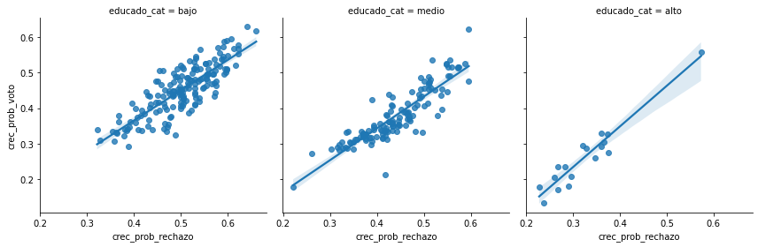
    


```python
sns.histplot(data=d2, x='educado?', hue='educado_cat', element='poly')
```


    <AxesSubplot:xlabel='educado?', ylabel='Count'>


    
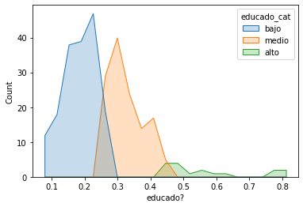
    


Pareciera que no: si bien es verdad que las personas con mayor nivel educacional votan más (pues el crecimiento de la probabilidad de voto es, en términos absolutos, mayor entre las comunas con mayor población educada, cosa que se debe a que las personas más educadas tienden a votar más), la recta de regresión cubre el mismo espacio numérico en los tres grupos: esto es, si bien las personas más educadas sí crecieron en menor cantidad absoluta el voto y el rechazo, **en todos los grupos el crecimiento sigue la misma correlación**. ¿acaso puede ser el interés en la política el factor que explica la cuestión?

Lamentablemente, para esto tenemos menos datos: CASEN, por ejemplo, no pregunta a las personas por su nivel de participación en política (cosa que es éticamente correcta, por razones de privacidad). Sin embargo, tenemos datos respecto de la probabilidad de votar nulo o blanco, facilidados por los resultados electorales publicados por SERVEL.


```python
d2['entrada_prob_nb']=d2['entrada_prob_nulo']+d2['entrada_prob_blanco']
d2['salida_prob_nb']=d2['salida_prob_nulo']+d2['salida_prob_blanco']
sns.histplot([d2['entrada_prob_nb'],d2['salida_prob_nb']])
```


    <AxesSubplot:ylabel='Count'>


    
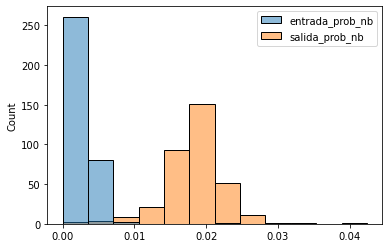
    


El plebiscito de salida tuvo una cantidad mucho más alta de votos nulos y blancos que el plebiscito de entrada: esto parece lógico, toda vez que el segundo plebiscito fué obligatorio, y que por ende alguna proporción de las personas que no van a votar usualmente, viendose ante la obligación de hacerlo, se rehusaron a hacerlo de manera sustantiva (es decir, votaron nulo o blanco).


```python
sns.lmplot(
    data=d2, x="crec_prob_rechazo", y="salida_prob_nb",
    col="educado_cat", height=6
)
```


    <seaborn.axisgrid.FacetGrid at 0x24845ff2cd0>


    
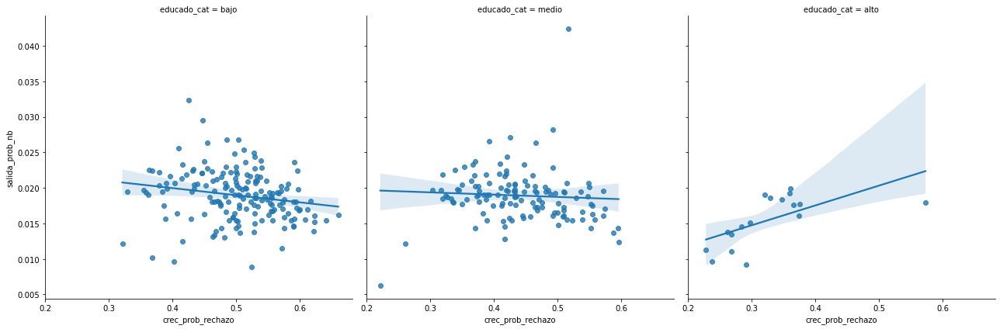
    


Sólo en el segmento educacional más alto (es decir, en las comunas con mayor cantidad de personas con acceso a la educación superior) se observa una correlación entre el crecimiento del rechazo y la probabilidad de votar nulo o blanco, pero en la población general no se da el caso, sino que más bien los dispersogramas aparecen como una nube de puntos aleatoriamente distribuidos, si acaso con alguna tendencia negativa.


```python
sns.lmplot(data=d2, x='salida_prob_nb', y='crec_prob_voto', hue='educado_cat', height=9)
```


    <seaborn.axisgrid.FacetGrid at 0x24848b2f3d0>


    
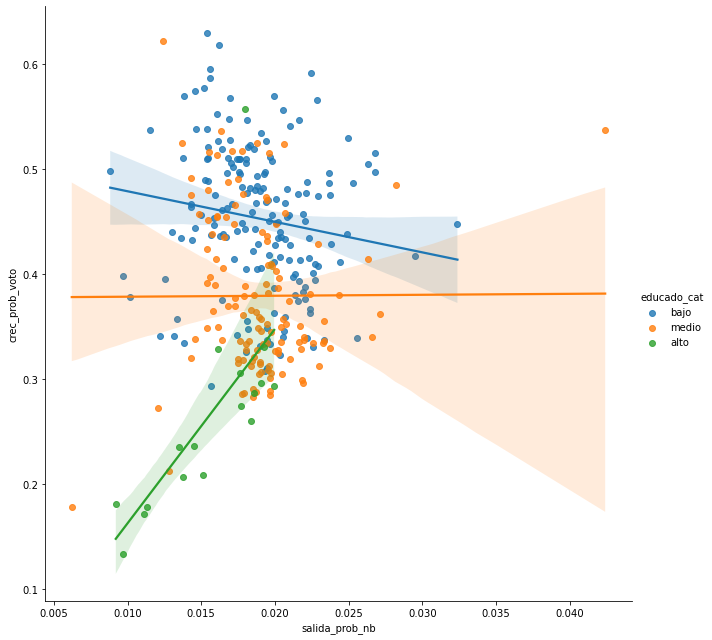
    


Respecto de la votación nula y blanca, se observa una diferencia en el comportamiento del voto blanco o nulo: en los sectores de educación más alta a mayor probabilidad de voto mayor probabilidad de voto nulo o blanco, mientras que en las comunas de menor y medio nivel educacional la correlación no aparece. De esto no podemos deducir mucho, más allá de decir que el comportamiento electoral, al menos en este plebiscito, de las personas de las comunas de alto nivel educacional es diferente al de las demás comunas. 


```python
d2[['crec_prob_voto', 'crec_prob_apruebo']].corr()
```


<div>
<style scoped>
    .dataframe tbody tr th:only-of-type {
        vertical-align: middle;
    }

    .dataframe tbody tr th {
        vertical-align: top;
    }

    .dataframe thead th {
        text-align: right;
    }
</style>
<table border="1" class="dataframe">
  <thead>
    <tr style="text-align: right;">
      <th></th>
      <th>crec_prob_voto</th>
      <th>crec_prob_apruebo</th>
    </tr>
  </thead>
  <tbody>
    <tr>
      <th>crec_prob_voto</th>
      <td>1.000000</td>
      <td>0.258914</td>
    </tr>
    <tr>
      <th>crec_prob_apruebo</th>
      <td>0.258914</td>
      <td>1.000000</td>
    </tr>
  </tbody>
</table>
</div>


```python
sns.regplot(data=d2, x='entrada_apruebo', y='salida_apruebo', color = 'red')
```


    <AxesSubplot:xlabel='entrada_apruebo', ylabel='salida_apruebo'>


    
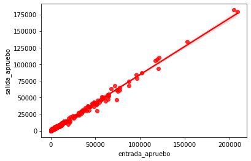
    


```python
sns.regplot(data=d2, x='entrada_rechazo', y='salida_rechazo', color = 'blue', marker = 'x')
```


    <AxesSubplot:xlabel='entrada_rechazo', ylabel='salida_rechazo'>


    
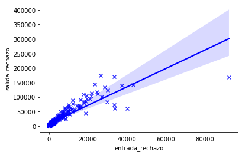
    


```python
sns.regplot(data=d2, x='entrada_prob_apruebo', y='salida_prob_apruebo', color = 'red')
```


    <AxesSubplot:xlabel='entrada_prob_apruebo', ylabel='salida_prob_apruebo'>


    
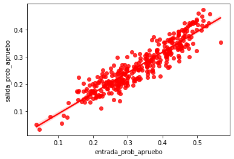
    


```python

```
